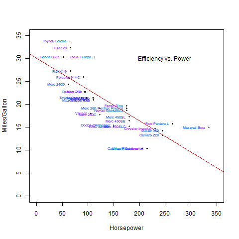

```{r setup, include=FALSE}
knitr::opts_chunk$set(echo = TRUE)
knitr::opts_chunk$set(eval = FALSE)
```

## Agenda 

1. Import 
2. Transform (Tidy Data, dplyr/tidyr, pipes)
3. Visualize


# 1. Import

## `read.csv()`

<div class = "right">
- works for local or web files
- use for csv, and tsv files
- many options to do initial clean
- hint: stringsAsFactors
</div>

<div class = "left">
```{r}
read.csv("./folder/filename.csv")
read.csv("https://exam.com/file.csv")
read.csv("./folder/tabfile.tsv",
         sep = "\t")
read.csv("./folder/filename.csv",
         header = F,
         na.strings = c("NAN","-"))
read.csv("file.csv",
         stringsAsFactors = F)
```
</div>

## `fread()`

<div class = "left">
- read.csv() but faster
- can be more intuitive
- few more options
</div>

<div class = "right">
```{r}
require(data.table)
fread("./folder/filename.csv")
fread("somelargefile.csv")
fread("file.csv",skip = 10
      ,select = c("a","b","c"))

```
</div>

## `read_excel()`

<div class = "right">
- read Excel sheets
- Specify sheet and range
- Only read one sheet at a time
- Can read each sheet into a list
</div>

<div class = "left">
```{r}
require(readxl)
read_excel("file.xlsx"
           ,sheet = 1
           ,range = "A1:C20")
```
</div>


## Database Queries

- Same SQL syntax
- Wrapped in connection/query functions
- Remember to close your connection! 
- [Other Best Practices](https://db.rstudio.com/best-practices/)

##

```{r}
require(odbc)
connection <- dbConnect(
  odbc(),
  Driver = "SQLServer",
  Server = "ServerName",
  Database = "DbName",
  UID = "UserName",
  PWD = rstudioapi::askForPassword("Database password")
  )
dbGetQuery(connection,'
  select * from DbName.dbo.TableName'
  )
closeAllConnections()
```


# 2. Transform

## Tidy Data

- Clean
- One observation per row
- Minimal
- Easy to understand

## dplyr/tidyr

<div class = "left">
- Easy-to-read syntax
- Filter
- Mutate
- Gather/Spread
- Summarise
- Group_by
- Pipes (%>%)
- [Cheatsheet](https://www.rstudio.com/wp-content/uploads/2015/02/data-wrangling-cheatsheet.pdf)
</div>

<div class = "right">

```{r}
require(tidyr)
require(dplyr)

data %>%
  group_by(val1, val2) %>%
  filter(value > 25) %>%
  mutate(
    avgVal = mean(val3, na.rm = T)
    ) %>%
  summarise(
    group_avg = mean(avgVal))
  
```
</div>

# 3. Visualize

## Base R

- Great for publications
- Low processing requirement
- No package necessary
- Syntax is more verbose/challenging
- "Boring" initially
- No themes available
- Not as dynamic

##

<div class = "left">
```{r eval=T, message=FALSE, results=FALSE}
png('baseplot.png')
plot(mpg~hp,data = mtcars,
     pch = 16, cex = 0.5,
     xlab = 'Horsepower',
     ylab = 'Miles/Gallon',
     xlim = c(0,350),
     ylim = c(0,35))
abline(lm(mpg~hp,data = mtcars),
       col = 'Red')
text(x = 250, y = 30,
     'Efficiency vs. Power')
text(mtcars$hp, mtcars$mpg, 
     row.names(mtcars), 
     cex = 0.6, pos = 2, 
     col = 'blue')
dev.off()
```
</div>

<div class = "right">




</div>

## GGplot2

- Similar syntax to dplyr
- Dynamic
- Themes
- Requires package
- Larger files/More processing
- More modern looking (arguable)
- Can save a plot object

##

<div class = "left">
```{r eval=T, message=FALSE,results=FALSE}
require(ggplot2) 
require(dplyr)
plot <-
mtcars %>%
  ggplot(aes(hp, mpg)) +
  geom_point() +
  geom_text(aes(
    label = rownames(mtcars)),
            hjust = 0,
            vjust = -0.5,
            color = "blue") +
  geom_text(
    x = 250, y = 30,
    aes(
    label = 
      "Efficiency vs. Power"))+
  geom_smooth(method = "lm", 
              color = "red",
              se = F) +
  xlab("Horsepower") +
  ylab("Miles/Gallon") +
  theme_classic()
```
</div>

<div class = "right">
```{r eval = TRUE, echo = FALSE}
plot
```


</div>

## plotly

- All the benefits of ggplot
- Adds interactivity
- Much larger files and more processing
- Need to be running an instance of R to view

##

```{r eval=FALSE, message=FALSE, warning=FALSE}
require(plotly)
a <- list(  gridcolor = toRGB("white"), linecolor = toRGB("white"),
            backgroundcolor = toRGB("black"), color = toRGB('white'),
            showbackground = TRUE)
plot_ly(mtcars, x = ~wt, y = ~hp, z = ~mpg, text = rownames(mtcars),
        marker = list(color = toRGB('green'),
                      line = list(color = toRGB('white')),
                      sizeref = 0.15, sizemode = "area")) %>%
  add_markers(size = ~cyl) %>%
  layout(scene = list(xaxis = a, yaxis = a, zaxis = a,
                      bgcolor = 'transparent'),
         paper_bgcolor = 'transparent')
```

##

```{r eval=TRUE, echo = FALSE, message=FALSE, warning=FALSE}
require(plotly)
a <- list(
  gridcolor = toRGB("white"),
  linecolor = toRGB("white"),
  backgroundcolor = toRGB("black"),
  color = toRGB('white'),
  showbackground = TRUE
)
plot_ly(mtcars, x = ~wt,
        y = ~hp,
        z = ~mpg,
        text = rownames(mtcars),
        marker = list(color = toRGB('green'),
                      line = list(color = toRGB('white')),
                      sizeref = 0.05,
                      sizemode = "area")) %>%
  add_markers(size = ~cyl) %>%
  layout(scene = list(xaxis = a,
                      yaxis = a,
                      zaxis = a,
                      bgcolor = 'transparent'),
         paper_bgcolor = 'transparent')
  
```
