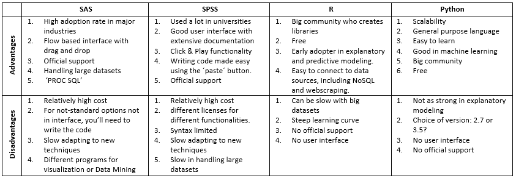

```{r setup, include=FALSE}
knitr::opts_chunk$set(echo = FALSE)
```

## Adgenda 

1. What is R
2. Suggested Workflow
3. Document Types
4. Style Guide
5. Packages


# 1. What is R


## Origin

- Developed in 1995 at the University of Auckland, New Zealand
- Derivative of the S language developed by Bell Laboratories (Formerly AT&T)

## Free and Open Source

- 100% free
- Active development
- Code transparency

## Enhanced Reproducitility

- Run reports the same way every time
- Not just calculations but figures and documenation as well

## Reporting Flexibility

- HTML
- PDF
- Web Apps
- Slideshows
- Much more! 

## Great support

- Many online communities
- Open source means quick, colaborative changes
- Great primary and third-party documentation

## Competitors



## Recap

- R developed in 1995
- Free, Open Source, and Powerful
- Enables incredible reproducibility and flexibility
- Tremendous support in multiple places
- Good, but not the only option

# 2. Suggested Workflow


## Projects

<div class = "left">
  
</div>

<div class = "right">
  - Self-contained
  - Portable
  - Open with one file
  - Start one with each new _**Project**_
</div>

## Packrat

- Save your package library information 
- Make sharing projects easier and more reliable
- Like projects, do it from the get-go

## Github
<div class = "left">

</div>
<div class = "right">
  - Yet another step towards reproducibility 
  - When using Projects and Packrat this is the next logical step
  - Options for public/private repositories
  - Potential for Enterprise level integration
</div>

## Recap

1. Project
2. Packrat
3. SourceControl

# 3. Document Types


## Scripts 

<div class ="left">
```{r echo = TRUE}
variable <- "Hello"
pair <- "World!"
paste(variable, pair, sep = " ")
```
</div>
<div class = "right">
  - .R file extension
  - Simple top-to-bottom execution
  - Can be ran in GUI or Console
  - Usually for stats analysis and data manipulation
</div>

## RMarkdown

```{r echo = FALSE, message=F, warning=F}
library(dplyr)
library(ggplot2)
```
<div class = "left">
```{r echo =TRUE}
mtcars %>% filter(mpg > 20) %>%
  ggplot(.,aes(mpg,hp)) + geom_point()
```
</div>

<div class = "right">
  - .RMD file extension
  - Add your code and results to a markdown document
  - Can create many output file formats
  - This presentation was written in an RMD file
  - Mostly standard markdown language
</div>

---

Code for the previous slide: 

```{r results=F, eval=F, message=F, warning=F, echo = T}
## RMarkdown
<div class = "left">
``{r echo = FALSE, message=F, warning=F}

mtcars %>% filter(mpg > 20) %>%
  ggplot(.,aes(mpg,hp)) + geom_point()
``
</div>
<div class = "right">
  - .RMD file extension
  - Add your code and results to a markdown document
  - Can create many output file formats
  - This presentation was written in an RMD file
  - Mostly common markdown language
</div>
```

---
## Shiny Apps

<div class = "left">
  
</div>

<div class = "right">
  
  - Interactive and Reactive data manipulation
  - Must be running on an R instance (client or server)
  - Great for data exploration
  
</div>

## Recap

- Scripts = simple and repeatable 
- RMarkdown = Code + Documentation
- Shiny = Interactive

# 4. Style Guide

## Assignment

<div class = "left">
```{r echo = T, eval = F}
value -> 25 #WRONG

value = 25 #Generally bad

value <- 25 #Correct
```
</div>

<div class = "right">
  - use the left arrow (<-) operator
  - equal sign is used in comparrisons
  - variable on the left value on the right
</div>

## Naming

<div class = "left">
```{r echo = T, eval = F}
1stValue <- "Not Allowed"

val2 <- 1 + 2 # BAD

firstValue <- 1 + 2 # Better

Total_Time_ms <- 1 + 2 # Best
```

</div>

<div class = "right">
  - Underscores
  - Descriptive
  - Include Units
  - Can't start with a number
</div>

## Spacing and Syntax


```{r echo = T, eval = F}
Total_Time_ms_bad<-(5*3)+1-4 # BAD

Total_Time_ms_good <- (5*3) + 1 - 4 # Good

Comparisson_Bad <- TRUE>1|TRUE==FALSE # BAD

Comparisson_good <- TRUE > 1 | TRUE == FALSE #GOOD
```

  - spaces between arithmatic operators
  - spaces between comparisson operators
  - Use R Studio's built-in syntax checker

## Recap

- Assign to the left
- Spaces Everywhere
- Descriptive Names with Underscores

# 5. Packages


## What are they? 

- Small Addons that increase functionality
- Usually targeted at one general purpose (cleaning, stats method, etc.)
- Must be installed AND loaded before use

```{r echo = T, eval = F}
install.packages('ggplot2')
library(ggplot2)
```


## Popular packages

- ggplot2 (plotting)
- plotly (interactive plotting)
- dplyr (Data Transformations)
- readxl (.xlsx importing)
- mass (various statistics functions/datasets)
- car (**C**ompanion to **A**pplied **R**egression)

## [Tidyverse](https://www.tidyverse.org/)

<div class = "left">

</div>

<div class = "right">
- Package of packages
- Everything you need to get started with data cleaning
- Be careful, large and takes a while to install
- Unified syntax and strong compatibility
</div>

# 6. Summary

##
- R is Free, Open source, and enables reproducibility
- Projects -> Packrat -> Source Control
- Scrips, RMarkdown, Shiny
- Spacing, Description, left-assignment
- Packages add functionality