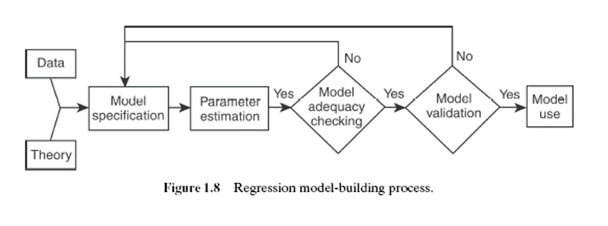
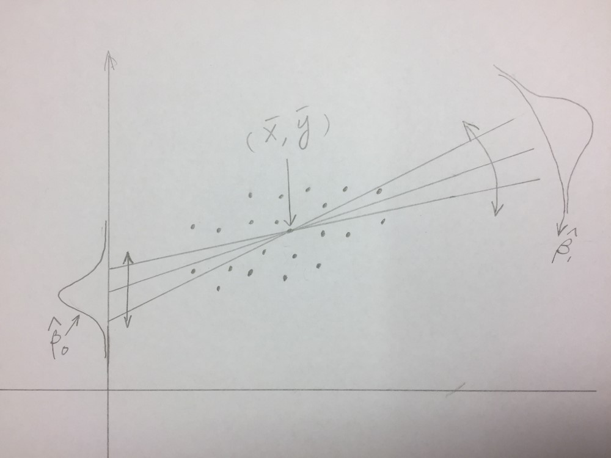
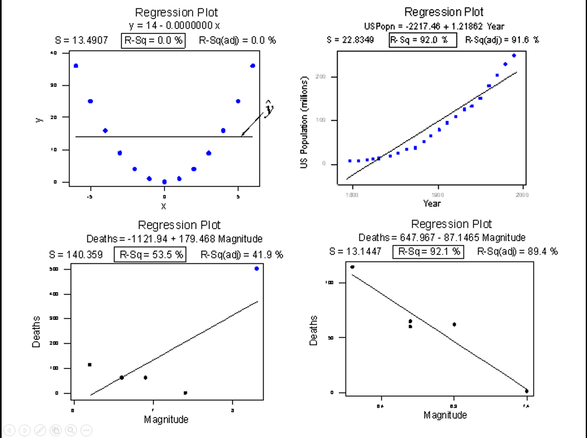
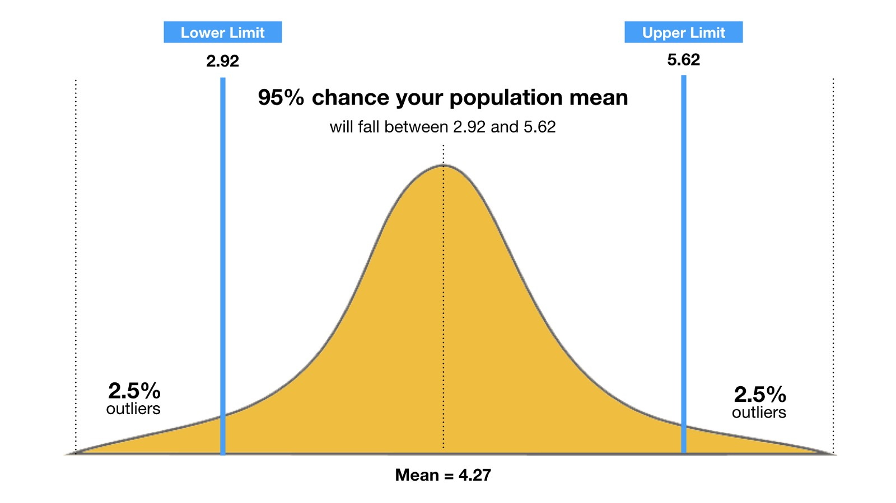

## Agenda

- Terminology
- Model Building Process
- Simple Linear Regression
- Multiple Regression 



# 1. Terminology 

## Residuals


The difference ( $\Delta$) between observed value ($y_x$) and estimated value $\hat{y}$


## Standard Error

<div class = "left">
- The "wiggle room" around the population mean $(\bar{x},\bar{y})$ of your regression line
- This "wiggle" is a normal distribution at the extreme X values
- Lower is better
</div>

<div class = "right">

</div>

## R^2 and Adj. R^2

<div class = "left">
- The "fit" of your regression equation
- How tightly are observed values $(y_i,x_i)$ clustered around your estimated values $(\hat{x}_i,\hat{y}_i)$ 
- 0 < x < 1
- Higher is better
</div>

<div class = "right">

</div>


## Confidence Interval

- The lower and upper bounds of your $\hat{y}$ value given a particular $\alpha$-value
- Typically, $\alpha = 0.95$



## p-value

- probability of experiencing the observed results assuming the Null Hypothesis $H_0$ is held true
- Probability that any difference observed is significant
- Value between 0 and 1
- Lower is "better"
- $1 - \alpha =$ upper $p$ limit

## Transformation

- Mathematical operations done to linearize a regression
- Ex:
    * Sqrt()
    * ln()
    * (1/sqrt())
    * and more
- Can determine with lambda from Box-Cox

## Multicollinearity

- When the inclusion of one variable influences another and visa versa
- This is detrimental to a good regression equation
- Solved by removing one or another variable 
- Can test with Variance Inflation Factor (VIF function) in R

# 2. Modeling Process/Simple Linear Regression

## 

We will use the `airquality' dataset for the remainder of this presentation. This is found in the 'datasets' package. Install it if necessary and load it with the code below: 

```{r echo=TRUE, message=FALSE, warning=FALSE}
require(datasets)
```

## Data Examination

Before you start modeling it is important to 
explore your data from a high level

- Structure
- Summary statistics
- Figures

## Structure 

Let's examine the structure of the 'flights' dataset: 

```{r echo=TRUE, message=FALSE, warning=FALSE}
str(airquality)
```

## Summary Statistics

```{r}
summary(airquality)
```

## Figures

```{r echo= FALSE, message=FALSE, warning=FALSE}
require(psych)
pairs.panels(airquality)
```


## Model Beginnings

- Start with your hypothesised model
- This is usually either the simplest or most complicated model
- Simplest model is generally: $y = B_0 + B_1x$
- "Most" complicated is generally: $y = B_0 + B_1x_1 + B_2x_2 + B_nx_n$

## Psudo Models

- Salary ~ HoursWorked
- Salary ~ HoursWorked + Experience + Infractions + age 
- Ozone ~ Temp + Wind + Solar.R + Month + Day


## Coefficient Analysis

Let's start building a model for the airquality data.

Start with a simple model (ozone as response variable): 

```{r}
model1 <- lm(Ozone ~ Temp, data = airquality)
```

View the summary: 
```{r echo=TRUE, eval=FALSE}
summary(model1)
```

##
```{r echo = FALSE}
summary(model1)
```

## Key values

Coefficients

- Slope ($\beta_1$)
- Intercept ($\beta_0$)

Goodness of fit

- p-value
- Adj R-squared

## Residual Analysis

- Help to get an idea of goodness of fit
- May suggest a possible transformation
- Help to spot outliers

```{r eval=FALSE}
par(mfrow = c(2,2))
plot(model1)
```

## 

```{r echo = FALSE}
par(mfrow = c(2,2))
plot(model1)
```

## Transformation

- [Use the QQ plot](https://stats.stackexchange.com/questions/101274/how-to-interpret-a-qq-plot) (skewness) as well as the [Fitted v. Residuals plot](http://docs.statwing.com/interpreting-residual-plots-to-improve-your-regression/) (normalcy) to determine possible transformations
- Can also use Box-Cox test 
    * More exact but not as easy to explain
    
## 

```{r}
model3 <- lm(log(Ozone) ~ log(Temp), data = airquality)
summary(model3)
```

##

```{r}
par(mfrow = c(2,2))
plot(model3)
```

##

Better Adj. $r^2$ but only by 2%

Is this worth the transformation? 

Is the original model that bad?

## Validation

- **Train** your model on a subset of data (70%)
- **Test** your model on another subset (20%)
- **Validate** your model on yet another subset (10%)

This method is good for ensuring the accuracy
and predictive strength of your model


## Model Recommendation

# 3. Multivariate Linear Regression (Full Example)

## Data

Wine Quality: A classic example

```{r}
require(data.table)
wine <- fread("../Data/winequality-red.csv")
```

## Summary Stats and Visual Assesment

```{r}
str(wine)
```

##

```{r}
summary(wine)
```

## 

```{r echo = FALSE, message = FALSE, warning  = FALSE}
pairs.panels(wine)
```

## 

<div class = "left">
```{r echo = FALSE, message=FALSE, warning=FALSE}
require(ggplot2)
ggplot(wine, aes(alcohol, quality)) +
  geom_point(aes(size = `volatile acidity`), alpha = 0.1)
```
</div>

<div class = "right">
```{r eval = FALSE, echo = TRUE}
require(ggplot2)
ggplot(wine, aes(alcohol,quality))+
  geom_point(aes(
    size = `volatile acidity`)
    , alpha = 0.1)
```
</div>

## Beginning Model

```{r}
model1 <- lm(quality~. , data = wine)
summary(model1)
```


## Variable Pruning 

Multicolinearity?
```{r message = FALSE, warning = FALSE}
require(car)
vif(model1)
```

## Stepwise Variable Selection

```{r eval = T, results=F}
sm1 <- step(model1,direction = 'backward')
```

```{r}
sm1
```

##

```{r eval=T, results=F}
minModel <- lm(quality~1, data = wine)
maxModel <- formula(lm(quality~., data = wine))
sm2 <- step(minModel, direction = 'forward', scope = maxModel)
```

```{r}
sm2
```


## Test Model Selection Results

```{r}
model2 <- lm(formula = quality ~ `volatile acidity` + chlorides + `free sulfur dioxide` + 
    `total sulfur dioxide` + pH + sulphates + alcohol, data = wine)
summary(model2)
```

## 

```{r}
par(mfrow = c(2,2))
plot(model2)
```

## Final Model

$$quality = -volatile \space acidity        \nonumber \\
- 2*chlorides                               \nonumber \\
+ 0.01*free \space sulfur \space dioxide    \nonumber \\
- 0.003*total \space sulfur \space dioxide  \nonumber \\
- 0.5*pH + 0.9*sulphates + 0.3*alcohol$$


