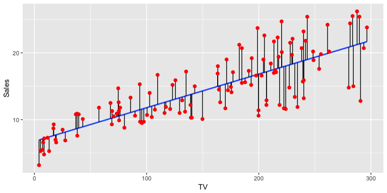

## Agenda
- Terminology
- Model Building Process
- Simple Linear Regression
- Multiple Regression 

# 1. Terminology 

## Residuals

## Standard Error

## R^2 and Adj. R^2

## p-value

## Confidence Interval

## Transformation

## Multicollinearity

# 2. Modeling Process

## Building

## Residual Analysis

## Transformation

## Model Trimming

## Validation

## Model Recommendation

# 3. Simple Linear Regression

## Data

## Starting Model

## Residual Analysis

## Transformation 

## Model Trimming

## Validation

## Model Recommendation

# 4. Multiple Regression