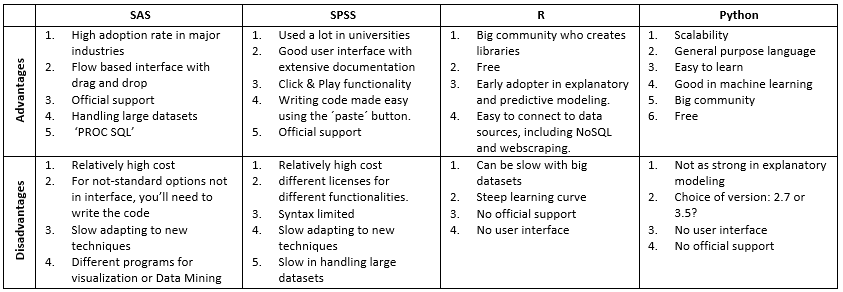

## What is *R*?

*R* is a powerful open source statistical programming language. It was developed in 1995 at the University of Auckland, New Zealand and is a derivative of the S language.[1](https://www.r-project.org/about.html) When you [download R](https://cran.r-project.org/bin/windows/base/R-3.5.1-win.exe), it comes with it's own IDE but most users turn to [R Studio](https://www.rstudio.com/) for all of their needs. 

## Why use *R*?

### It's Free! 

Not much more needs to be said here. *R* is full-featured, flexible, and most importantly - FREE!

### Reproducibility

Much like SSRS, creating documents in *R*, gives you the ability to serve up scripts, reports, and even web applications that are not only packed with statistical findings, but are also completely reproducible and dynamic. With *R*, you can work with flat files, data downloaded from the internet, or directly query databases. Regardless of your data sourcing method, creating programatic analyses in *R* allows your findings to change as your data source changes without the need for manual intervention. 

### Flexibility

Since *R* is open source, the list of available functions/packages is ever growing. Furthermore, since *R* is a programming language, you can write your own custom functions or alter existing functions to better suit your needs. Furthermore, the combination of *R* and RStudio allows you to create many different types of documents to present your findings in the most inuitive way. Some of the document types include:

* HTML
* PDF
* Slideshow
* Word
* JPG
* Web Application

### Support

As *R* has been steadily growing in popularity, there are many large communities available for support. Most notably, [Stack Overflow](https://stackoverflow.com/questions/tagged/r?sort=frequent&pageSize=15) and [R Bloggers](https://www.r-bloggers.com/) are great resources for getting help.

## Other Options

*R* is by no means the only options for programatic statistical modeling. Some of the other alternatives include:

* SAS / SPSS: These options are fairly old and usually come with a high cost to scale
* Python: Leading competitor, Jack of all trades but not as strong in modeling

## Further Exploration {.tabset .tabset-fade}

### Local Documents

* [R Basics](ScriptingBasics.nb.html)
* [Basic Analysis](BasicAnalysis.nb.html)

### Online Courses

* [UC-R: Data Wrangling Course](http://uc-r.github.io/data_wrangling): Free material with good powerpoints and assignments.
    - Requires Data Camp Premium Account to fully experience
* [Data Camp: Intro to R Course](https://www.datacamp.com/courses/free-introduction-to-r?utm_source=adwords_ppc&utm_campaignid=805200711&utm_adgroupid=39268379982&utm_device=c&utm_keyword=datacamp&utm_matchtype=e&utm_network=g&utm_adpostion=1t1&utm_creative=230953641482&utm_targetid=aud-299261629574:kwd-297372810188&utm_loc_interest_ms=&utm_loc_physical_ms=9015734&gclid=EAIaIQobChMI9uuAuOyo3AIV3ISzCh0R1wXdEAAYASABEgLR-_D_BwE): Paid material but very thorough and interactive
* [Coursera: Intro to R Course](https://www.coursera.org/learn/r-programming): Free to learn but paid if you need a certificate of completion
* [Pluralsight: Intro to R Course](https://app.pluralsight.com/library/courses/r-programming-fundamentals/table-of-contents): Can use TQL account for premium access
